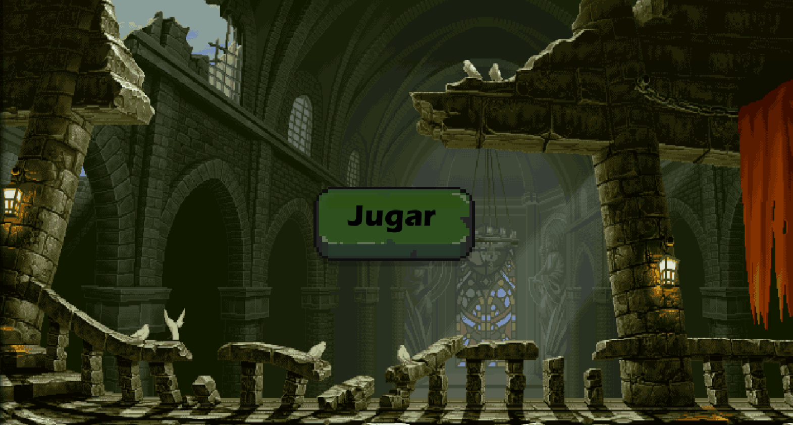
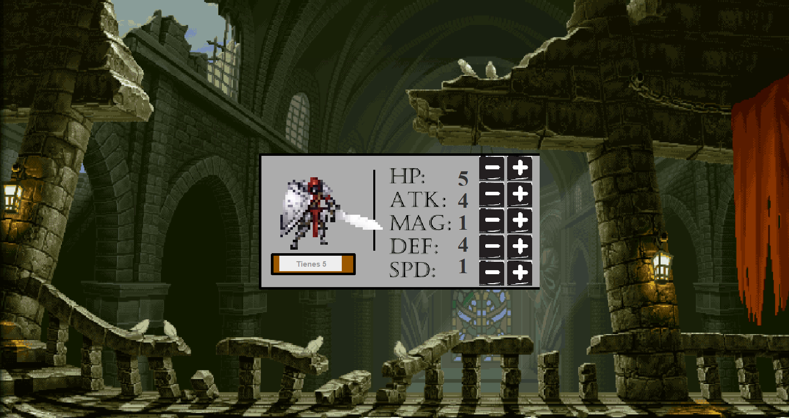
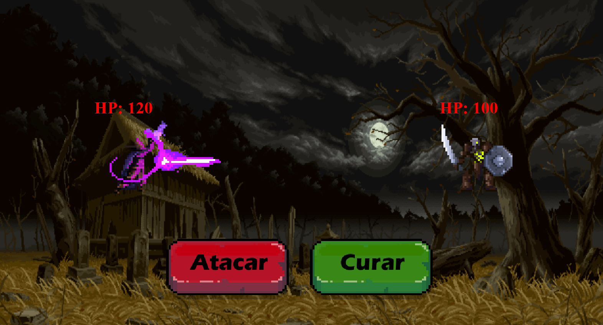
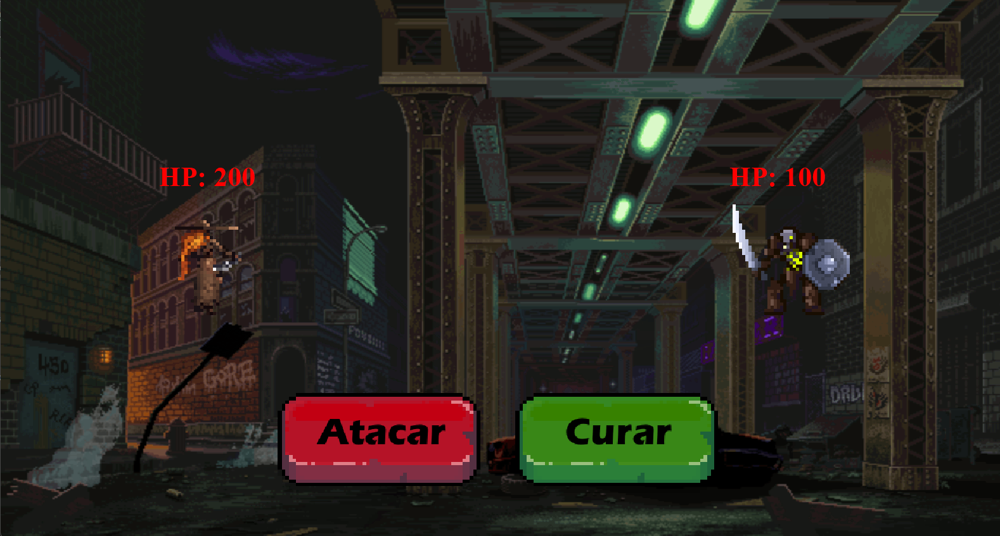

# Videojuego programado en Java para poner en práctica patrones de diseño del software

## Capturas

Pantalla principal

Pantalla de selección de personaje y estadísticas

Combate en diferentes terrenos

Integrantes del grupo:

* Alejandro Garcia
* David Villaverde
* Hugo Roman
